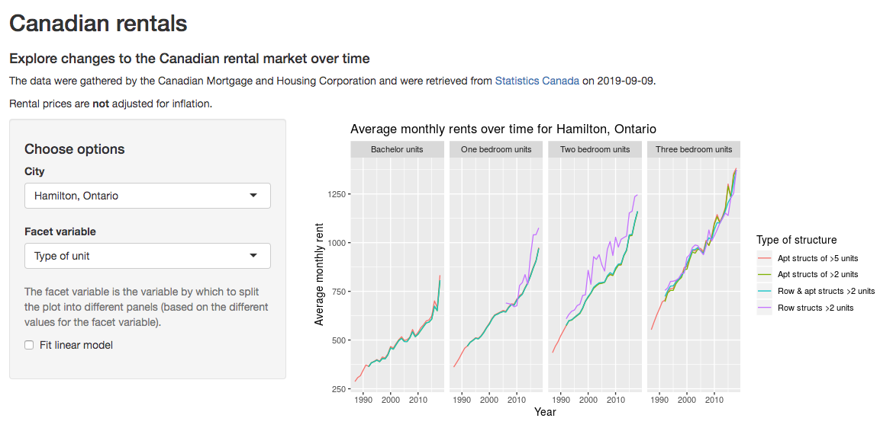
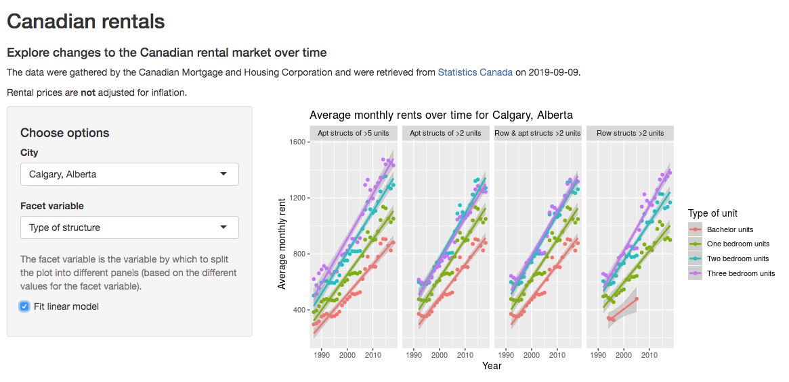

<style>
.reveal .slides section .slideContent{
    font-size: 24pt;
}
</style>

Exploring Canada's rental market over time
========================================================
author: Irena Papst
date: 2019-09-23
css: presentation.css
autosize: true
font-family: 'Helvetica'

Motivation
========================================================
- want to explore how the <b>Canadian housing rental market</b> has changed over time

- compare rental prices in a given <b>geographic region</b>

- compare across different <b>structure types</b> (*e.g.,* apartment vs. row structure) and <b>unit types</b> (*e.g.,* bachelor vs. 2 bedroom)


Data
========================================================


- data downloaded from <b>[Statistics Canada](https://www150.statcan.gc.ca/t1/tbl1/en/tv.action?pid=3410013301)</b> on 2019-09-09 and tidied 

```
[1] "Number of observations: 57977"
```

- <b>average monthly rental prices</b> measured over a long time range:

```r
range(housing$year)
```

```
[1] 1987 2018
```
- other features captured for each data point:
    * <b>geographic region</b>, usually a city (217 regions sampled)
    * type of <b>structure</b> (apartment building or row building, and size based on number of units)
    * type of <b>unit</b> (bachelor, 1-3 bedrooms)

App example: line plot
========================================================

<div align="center">

</div>

App example: linear model plot
========================================================

<div align="center">

</div>
